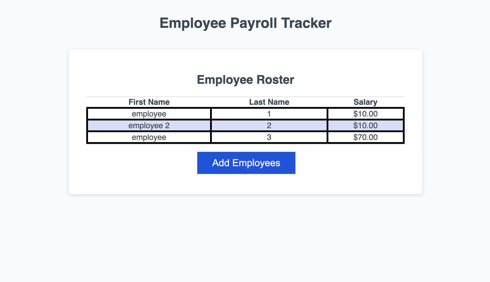

## Project Description

The following website is a payroll manager where a user can input the first name, last name, and salary of an employee. The purpose of this is to track employees salaries, calculate the average salary of the inputs, and determine a random winner of a lottery drawing from the list of employees. The data will be used to properly budget for the company.

## Instuctions

Once the page is opened you will notice a box which will list the array of all inputted employees and salaries. You will be prompted to enter the emplyee's first name, last name, and salary. Once this is done, you will recieve a a confirmation prompt that will ask if you would like to continue. These prompts wil continue in that order if you press "ok" on the confirmation prompt. Once you press 'cancel' and you are done inputting employee names and salaries, an array of employee names and salaries will be listed on the page. If you go to the console, you will notice that the average salary and winner of the drawing is displayed.

## Screenshots

